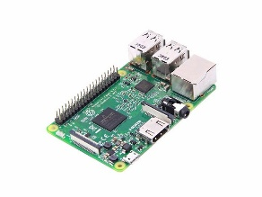
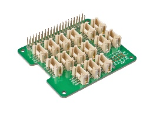
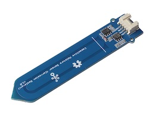

# Agrotech Hackathon

This workshop is a hands on lab for building an agrotech solution using [Azure IoT](https://azure.microsoft.com/overview/iot/?WT.mc_id=agrohack-github-jabenn).

The final project that will be created is an internet connected device with environment sensors, that connects to a set of services that will predict the weather using both [Azure Maps](https://azure.microsoft.com/services/azure-maps/?WT.mc_id=agrohack-github-jabenn) and an AI Model running in [Azure ML Studio](https://azure.microsoft.com/services/machine-learning/?WT.mc_id=agrohack-github-jabenn). This weather prediction will be combined with soil moisture data, and used to send a signal to another device to indicate if the plants need watering. The main workshop won't cover the additional device, it is in an optional step at the end as it requires more hardware.

Most of this implementation will use no-code solutions, such as [Azure IoT Central](https://azure.microsoft.com/services/iot-central/?WT.mc_id=agrohack-github-jabenn), an IoT Software-as-a-service (SaaS) platform. There will be some coding required, and this will all be in Python.

## Getting started

### Hardware requirements

Like all good IoT labs, you will need hardware to make this work. You will also need a plant to monitor.

#### The environment sensor

* A [Raspberry Pi](https://www.raspberrypi.org/products/raspberry-pi-4-model-b/) with an SD card and power supply, running Raspbian Lite.

  ,

* A [Grove base hat](https://www.seeedstudio.io/Grove-Base-Hat-for-Raspberry-Pi-p-3186.html)

  

* A [Grove BME280 temperature/pressure/humidity sensor](https://www.seeedstudio.io/Grove-Temp%26Humi%26Barometer-Sensor-%28BME280%29-p-2653.html)

  

* A [Grove capacitive moisture sensor](http://wiki.seeedstudio.com/Grove-Capacitive_Moisture_Sensor-Corrosion-Resistant/)

  

### Software

You will need to install some software to be able to program the Raspberry Pi.

* [Visual Studio Code](https://code.visualstudio.com/Download/?WT.mc_id=agrohack-github-jabenn)

### Azure account

To use Azure services you will need an Azure subscription. If you don't have a subscription you can sign up for free at [azure.microsoft.com/free/](https://azure.microsoft.com/free/?WT.mc_id=agrohack-github-jabenn). You will need a credit card for verification purposes only, you will not be billed unless you decide to upgrade your account to a paid offering. At the time of writing the free account will give you US$200 of free credit to spend on what you like in the first 30 days ($100 for the student account), 12 months of free services, plus a load of services that have tiers that are always free.

If you are a student aged 18 and up, or teacher and have an email address from an academic institution, you can sign up for the free Azure for Students offer at [azure.microsoft.com/free/students](https://azure.microsoft.com/free/students/?WT.mc_id=agrohack-github-jabenn) without a credit card. At the time of writing this gives you $100 of credit to use over 12 months, as well as free tiers of a number of services for that 2 months. At the end of the 12 months, if you are still a student you can renew and get another $100 in credit and 12 months of free services.

## The workshop

### Steps

1. [Set up the environment monitor](./Steps/SetUpTheEnvironmentMonitor.md)
1. [Create the application in Azure IoT Central](./Steps/CreateTheAppInIoTCentral.md)
1. [Write the code to capture telemetry from the Raspberry Pi](./Steps/WriteThePiCode.md)
1. [Export data to Azure Blob Storage](./Steps/ExportDataToBlobStorage.md)

## Storing the data

### Creating a storage account

### Adding data export to Azure IoT Central

## Querying Azure Maps for weather data

### Setting up Azure Maps

### Querying for weather data

## Query an AI model for weather

### Building and training the model

### Deploying the model

### Calling the model to get weather data

## Controlling the water indicator

### Setting up the device in Azure IoT Central

### Sending a message to the device
