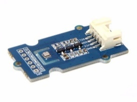
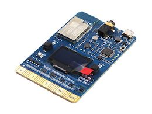

# Agrotech Hackathon

This workshop is a hands on lab for building an agrotech solution using [Azure IoT](https://azure.microsoft.com/overview/iot/?WT.mc_id=agrohack-github-jabenn).

The final project that will be created is an internet connected device with environment sensors, that connects to a set of services that will predict the weather using both [Azure Maps](https://azure.microsoft.com/services/azure-maps/?WT.mc_id=agrohack-github-jabenn) and an AI Model running in [Azure ML Studio](https://azure.microsoft.com/services/machine-learning/?WT.mc_id=agrohack-github-jabenn). This weather prediction will be combined with soil moisture data, and used to send a signal to another device to indicate if the plants need watering.

Most of this implementation will use no-code solutions, such as [Azure IoT Central](https://azure.microsoft.com/services/iot-central/?WT.mc_id=agrohack-github-jabenn), an IoT Software-as-a-service (SaaS) platform. There will be some coding required, and this will all be in Python.

## Getting started

### Hardware requirements

Like all good IoT labs, you will need hardware to make this work.

#### The environment sensor

* A [Raspberry Pi](https://www.raspberrypi.org/products/raspberry-pi-4-model-b/) running Raspbian Lite.

  

* A [Grove base hat](https://www.seeedstudio.io/Grove-Base-Hat-for-Raspberry-Pi-p-3186.html)

  

* A [Grove BME280 temperature/pressure/humidity sensor](https://www.seeedstudio.io/Grove-Temp%26Humi%26Barometer-Sensor-%28BME280%29-p-2653.html)

  

* A [Grove capacitive moisture sensor](http://wiki.seeedstudio.com/Grove-Capacitive_Moisture_Sensor-Corrosion-Resistant/)

  

#### Watering indicator

* An [MXChip Azure IoT DevKit](https://microsoft.github.io/azure-iot-developer-kit/)

  

### Software

You will need to install some software to be able to program the different bits of hardware.

* [Visual Studio Code](https://code.visualstudio.com/Download/?WT.mc_id=agrohack-github-jabenn)
* [Arduino IDE](https://www.arduino.cc/en/Main/Software) - **NOTE** On Windows DO NOT install using the Windows store, instead use the *Windows Installer, for Windows XP and up*.
* You may need to install a USB driver or configure USB support to communicate with the MXChip.

  * Windows: Download and install USB driver from [STMicro](http://www.st.com/en/development-tools/stsw-link009.html).

  * macOS: No driver is required for macOS.

  * Linux: Run the following in terminal and logout and login for the group change to take effect:

    ```bash
    # Copy the default rules. This grants permission to the group 'plugdev'
    sudo cp ~/.arduino15/packages/AZ3166/tools/openocd/0.10.0/linux/contrib/60-openocd.rules /etc/udev/rules.d/
    sudo udevadm control --reload-rules

    # Add yourself to the group 'plugdev'
    # Logout and log back in for the group to take effect
    sudo usermod -a -G plugdev $(whoami)

### Azure account

To use Azure IoT Hub you will need an Azure subscription. If you don't have a subscription you can sign up for free at [azure.microsoft.com/free/](https://azure.microsoft.com/free/?WT.mc_id=agrohack-github-jabenn). You will need a credit card for verification purposes only, you will not be billed unless you decide to upgrade your account to a paid offering. At the time of writing the free account will give you US$200 of free credit to spend on what you like in the first 30 days ($100 for the student account), 12 months of free services, plus a load of services that have tiers that are always free.

If you are a student aged 18 and up, or teacher and have an email address from an academic institution, you can sign up for the free Azure for Students offer at [azure.microsoft.com/free/students](https://azure.microsoft.com/free/students/?WT.mc_id=agrohack-github-jabenn) without a credit card. At the time of writing this gives you $100 of credit to use over 12 months, as well as free tiers of a number of services for that 2 months. At the end of the 12 months, if you are still a student you can renew and get another $100 in credit and 12 months of free services.

## The workshop

### Steps

1. [Create the application in IoT Central](./Steps/CreateTheAppInIoTCentral.md)


## The environment monitor

### Constructing the hardware

### Writing the software

### Verifying that it all works

## Storing the data

### Creating a storage account

### Adding data export to IoT Central

## Querying Azure Maps for weather data

### Setting up Azure Maps

### Querying for weather data

## Query an AI model for weather

### Building and training the model

### Deploying the model

### Calling the model to get weather data

## Controlling the water indicator

### Setting up the device in IoT Central

### Sending a message to the device
