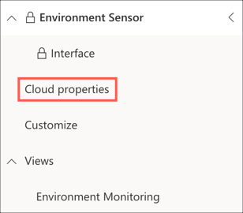

# Loop up the weather for the device using Azure Maps

In the [previous step](./TriggerRule.md) you created an Azure IoT Central rule triggered when the soil moisture is too low. In this step you will look up the weather for the device's location using Azure Maps.

## Azure Maps

Azure Maps is an Azure service that provides mapping and related data. You can use it for visualizing maps on a web page with added data, or requesting spatial data, such as if a coordinate is inside a shape on a map, and even weather data.

For our soil moisture rule, if the soil is too dry then the plant needs a water. However, there is no need to water the plant if rain is predicted. Azure Maps can get the weather for the plants location, and from this the precipitation levels can be extracted to see if it will rain.

## Set the location against a device

To be able to get the weather for a device, the location must be known. This is where Cloud Properties in Azure IoT Central can be used - these are values that are not sent by or to the device, but are associated with it. A cloud property can be added to the device template for the location, and the value set for the device.

### Create the location cloud property

1. Open the app in Azure IoT Central

1. From the left-hand menu, select **Device Templates**

   

1. Select the `Environment Sensor` device template

1. Select **Cloud Properties** from the menu

   

1. Select **Add Cloud Property**

   

1. Set the *Display Name* to `Device Location`

1. Set the *Name* to `device_location`

1. Set the *Semantic Type* to `Location`. This will automatically set the *Schema* to `Geopoint`

1. Leave the rest of the fields with their default values

   

1. Select **Save**

   
