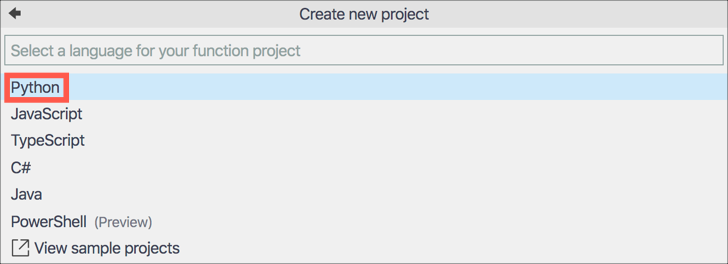
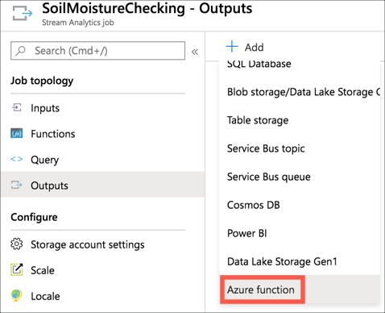
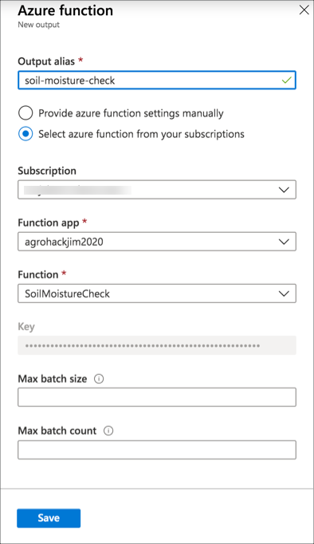
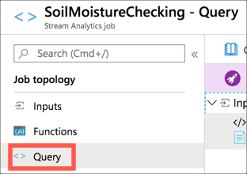
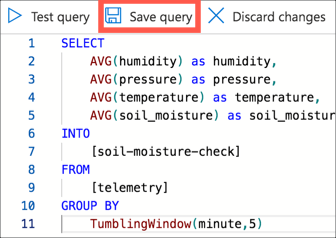
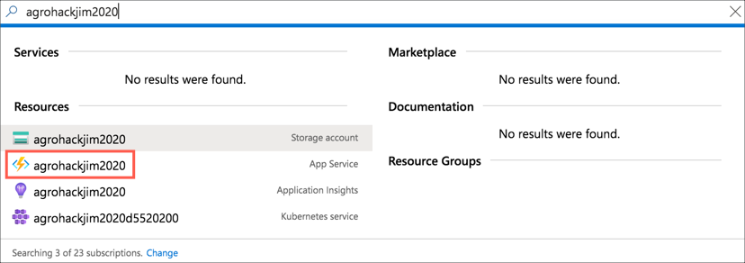

# Create an Azure Function triggered by Azure Stream Analytics to check soil moisture

In the [previous step](./ExportDataToBlobStorage.md), you exported IoT telemetry to Azure Blob Storage. In this step you will create an Azure Function triggered by Azure Stream Analytics to check soil moisture.

## Azure Functions

[Azure Functions](https://azure.microsoft.com/services/functions/?WT.mc_id=agrohack-github-jabenn) is an event driven serverless compute platform, essentially a way to define small blocks of code that are triggered by events such as a web request, data changes in storage or events being put onto an Azure Event Hub. They can be written in a multitude of different languages including C#, F#, Java, JavaScript and Python.

Azure Stream Analytics can call Azure Functions in response to streaming data, either individual messages or an aggregation across a time window.

To monitor soil moisture, the moisture measurement needs to be checked against a defined level, and if it is too low then the plant needs watering. Events are coming in every 60 seconds, and the moisture level doesn't need to be checked that often, instead an average over 5 minutes can be checked.

The Azure Function to be created will be triggered by a web request, called from Azure Stream Analytics.

### Configure Visual Studio Code for Azure Functions development

To build, test and deploy Azure Functions in Python using Visual Studio Code, you will need to install a couple of extensions.

1. Launch Visual Studio Code. You will be developing locally, so close any remote development sessions to the Raspberry Pi that you have open.

1. Select the Extensions tab from the left hand menu, or select *View -> Extensions*

   

1. Search for `Python` and install the *Python* extension from Microsoft by selecting **Install**.

   

   > There are a number of Python extensions available, so ensure you install the one from Microsoft

1. Search for `Azure Functions` and install the *Azure Functions* extension from Microsoft by selecting **Install**.

   

### Create a new Azure Functions project

Azure Functions can be created inside Visual Studio Code, or via the Azure CLI.

#### Create a new Azure Functions project in Visual Studio Code

1. Create a new folder for the Azure Functions project called `MoistureTrigger`

1. Launch Visual Studio Code and open the new folder using either the **Open Folder** button in the Explorer, or by selecting *File -> Open..*

1. From Visual Studio Code, launch the command palette

   * On macOS, press command+shift+p
   * On Windows or Linux, press ctrl+shift+p

1. Search for `Azure Functions: Create New Project` and select it

   

1. Select the folder to create the project in. The currently open folder will be one of the options, so select it.

   

1. Select **Python** for the function project language

   

1. The function will be created using a Python Virtual environment, so select the Python version to use. Select the latest version of Python 3 that you have installed.

   

1. The function project will be created with a single trigger. Select the *Http Trigger* option to have this function triggered by a web request.

   

1. Name the function `SoilMoistureCheck`

   

1. Set the function authorization level to `Function`. This means it can only be called using a key either as a header or a query string. Without the key the function cannot be called.

   

The project and virtual environment will be created. This will take a few seconds.

#### Create the Azure Functions project from the Azure CLI

1. From the terminal, create a new functions project called `MoistureTrigger` using the following command

   ```sh
   func init MoistureTrigger
   ```

1. The tool will ask what worker runtime you want, so enter the number for `Python`

   ```sh
   Select a number for worker runtime:
   1. dotnet
   2. node
   3. python
   4. powershell
   Choose option: 3
   ```

1. Once the function has been created, change to the functions folder with the following command

   ```sh
   cd MoistureTrigger
   ```

1. Create a new Python3 Virtual Environment inside the function folder with the following command

   ```sh
   python3 -m venv .venv
   ```

1. Create an Http trigger called SoilMoistureCheck with the following command. This trigger will be triggered by a web request. By default, the function authorization level will be set to `Function`. This means it can only be called using a key either as a header or a query string. Without the key the function cannot be called.

   ```sh
   func new --name SoilMoistureCheck --template "HttpTrigger"
   ```

1. Open the folder in Visual Studio Code to edit the function code using the following command

   ```sh
   code .
   ```

### Write the code for the function

In this step, the function just needs to exist so that it can be called by Azure Stream Analytics, along with some logging. In a later step more code will be added to it to check weather and execute an Azure IoT Central command.

> You can find all the code for this step in the [Code/Functions](../Code/Functions) folder.

1. Open the `__init__.py` file from the `SoilMoistureCheck` folder if it's not already open

1. Change the `main` function to the following:

    ```python
    def main(req: func.HttpRequest) -> func.HttpResponse:
        # Log the function was called
        logging.info('Python HTTP trigger function processed a request.')

        # Get the JSON from the request
        req_body = req.get_json()

        # Log the JSON
        logging.info(req_body)

        # The JSON can contain a single telemetry record or a list
        # If it's a list, get the last item
        if isinstance(req_body, list):
            req_body = req_body[-1]

        # Get the telemetry values
        temperature = req_body['temperature']
        pressure = req_body['pressure']
        humidity = req_body['humidity']
        soil_moisture = req_body['soil_moisture']

        # Log the values
        logging.info("temperature: %.1f, pressure: %.1f, pressure: %.1f, soil_moisture: %.1f",
                     temperature, pressure, humidity, soil_moisture)

        # Return a 200 status
        return func.HttpResponse(f"OK")
    ```

1. Save the file. If you don't want to have to remember to save files, you can turn on *Auto Save* by selecting *File -> Auto Save*.

### Test the function

The function can be tested from inside Visual Studio Code, or from the Azure CLI.

#### Test the function in Visual Studio Code

1. Select the debugger from the left-hand menu, or select `View -> Debug`

   

1. Select the **Start Debugging** button from the top of the debug pane. It is a green play triangle ▶️.

   

1. The Azure Functions runtime will launch and host the function. When it is running you will see the list of functions inside the app in the terminal containing the single Http trigger.

   

1. Test the trigger by opening [http://localhost:7071/api/SoilMoistureCheck](http://localhost:7071/api/SoilMoistureCheck) in your web browser. In the terminal in Visual Studio Code you will see the call being made, and the browser will show the output of `OK`.

   

1. When you have finished testing the function, detach from the functions host debugger by selecting the **Disconnect** button from the debug toolbar

   

#### Test the function using the Azure CLI

1. From the terminal activate the Python Virtual Environment

   1. On Windows use the following command

      ```sh
      .venv\Scripts\activate.bat
      ```

   1. On macOS use the following command

      ```sh
      source ./.venv/bin/activate
      ```

1. Install the require pip packages with the following command

   ```sh
   pip install -r requirements.txt
   ```

1. Launch the function with the following command

   ```sh
   func start
   ```

1. The Azure Functions runtime will launch and host the function. When it is running you will see the list of functions inside the app in the terminal containing the single Http trigger.

   

1. Test the trigger by opening [http://localhost:7071/api/SoilMoistureCheck](http://localhost:7071/api/SoilMoistureCheck) in your web browser. In the terminal in Visual Studio Code you will see the call being made, and the browser will show the output of `OK`.

   

1. When you have finished testing the function, detach from the functions host debugger by pressing ctrl+c.

## Deploy the function to Azure

Azure Stream Analytics needs to be able to access the URL for the function to be able to run it. This means it cannot call functions running locally, so the function will need to be published to Azure to make it publicly available and therefore callable from Azure Stream Analytics.

The function can be deployed from Visual Studio code, or the Azure CLI.

### Deploy the function from Visual Studio Code

1. From Visual Studio Code, launch the command palette

   * On macOS, press command+shift+p
   * On Windows or Linux, press ctrl+shift+p

1. Search for `Azure Functions: Deploy to Function App` and select it

   

1. If you have multiple Azure subscriptions a list of them will be shown, so select the correct one

1. Select `+ Create new Function App in Azure... (Advanced)`. There are two options with this name, one marked as `Advanced`. Select the one that is marked as `Advanced`. The Advanced option gives more control including adding the Function App to the existing Resource Group.

   

1. Give the Function App a name that is globally unique, so include things such as the date or your name, for example `agrohackjim2020`. To make it easier, name it the same as your Azure IoT Central app and storage account.

   

1. Select `Linux` for the OS

   

1. Select `Consumption` for the app service plan. This plan means you only pay based off the function app usage, with a generous free tier.

   

1. Select the latest Python 3 runtime that is available

   

1. Select the `AgroHack` Resource Group

   

1. Select the storage account that was created earlier for the data export

   

1. Select *Create new Application Insights Resource*. Application Insights allows you to monitor the Function App.

   

1. Accept the default Application Insights name

1. The Function App will be created and your code deployed. This will take a few seconds and a notification will pop up when complete.

1. Select the Azure tab from the left-hand menu

   

1. In the *Functions* section, expand your subscription to see all your Function Apps. Expand the newly created function app to see all functions.

   

1. Right-click on the *SoilMoistureCheck (HTTP)* function and select *Copy Function Url*

1. Paste this URL into a browser and test the function is working

### Deploy the function from the Azure CLI

1. Create a new Azure Function App to host the function using the following command

   ```sh
   az functionapp create
    --resource-group AgroHack
    --consumption-plan-location <location>
    --name <function_app_name>
    --storage-account <storage_account>
    --runtime python
    --os-type linux
   ```

   This will create a Function App in the `AgroHack` Resource Group, running on `linux` with the Python run time.

   For `<location>` use be the same location you created the other resources in.

   For `<function_app_name>`, pick a name that is globally unique, so include things such as the date or your name, for example `agrohackjim2020`. To make it easier, name it the same as your Azure IoT Central app and storage account.

   For `<storage_account>` use the name of the storage account you created when exporting data.

1. Deploy your function to this app with the following command

   ```sh
   func azure functionapp publish <function_app_name> --build remote
   ```

   For `<function_app_name>` use the name you used when creating the Function App

1. Once the function is deployed, the Http trigger URL will be listed in the terminal with a query string of `code=<key>`, the `key` being your Function App key. Copy this entire URL and test it out in a browser.

## Create a new Azure Stream Analytics Job

### Create the job

1. Follow the instructions in the [previous step](https://github.com/jimbobbennett/AgroHack/blob/master/Steps/ExportDataToBlobStorage.md#create-the-azure-stream-analytics-job) to create another Azure Stream Analytics Job. Name the job `SoilMoistureChecking`.

### Set an input

1. Follow the instructions in the [previous step](https://github.com/jimbobbennett/AgroHack/blob/master/Steps/ExportDataToBlobStorage.md#set-an-input) to set up an input from the Azure Event Hub.

### Set an output

1. From the Stream Analytics Job, select *Job topology -> Outputs* from the left-hand menu

   

1. Select **+ Add**, then select **Azure function**

   

1. Fill in the output details

   1. Set the alias to be `soil-moisture-check`

   1. Select *Select azure function from your subscriptions*

   1. Select your subscription

   1. Select the function app you just deployed to

   1. Select the `SoilMoistureCheck` function

   1. Leave the rest of the values as the defaults

   1. Select **Save**

   

### Create the query

1. From the Stream Analytics Job, select *Job topology -> Query* from the left-hand menu

   

1. Change the query to be the following

   ```sql
   SELECT
       AVG(humidity) as humidity,
       AVG(pressure) as pressure,
       AVG(temperature) as temperature,
       AVG(soil_moisture) as soil_moisture
   INTO
       [soil-moisture-check]
   FROM
       [telemetry]
   GROUP BY
       TumblingWindow(minute,5)
   ```

   This will select data as it comes into the `telemetry` event hub, grouping data using a 5 minute [tumbling window](https://docs.microsoft.com/stream-analytics-query/tumbling-window-azure-stream-analytics?WT.mc_id=agrohack-github-jabenn). This groups data into 5 minute blocks and calls the query for each block. The query will get the average value of 4 telemetry values.

1. Select **Test Query** to test the query and see a sample output using real data from the event hub

   

1. Select **Save Query**

   

### Start the job

1. From the Stream Analytics Job, select *Overview* from the left-hand menu

   

1. Select **Start**

   

1. For the *Job output start time* select **Now**

1. Select **Start**

   

## Validate the query

The easiest way to ensure the query is running correctly is by verifying that the Azure Function gets called.

1. Open the [Azure Portal](https://portal.azure.com/?WT.mc_id=agrohack-github-jabenn)

1. Log in with your Microsoft account if required

1. In the search bar, search for you Function Apps name

   

1. Select the Function app. It will be marked as an *App Service* and have a lightning bolt icon.

1. Expand the app and Functions nodes, and select **Monitor**

   

1. When the Azure Function is called an entry will appear in the table with a green tick

   

   It will take a few minutes for rows to appear as each window is 5 minutes, so nothing will appear until the 5 minute window is complete. Refresh the window using the **Refresh** button after a few minutes to see rows appear.

<hr>

In this step you created an Azure Function triggered by Azure Stream Analytics to check soil moisture. In the [next step](./ExecuteIoTCommand.md) you will add to this function to trigger an Azure IoT Central command if the soil moisture is too low.
