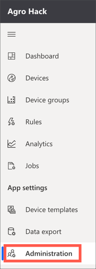
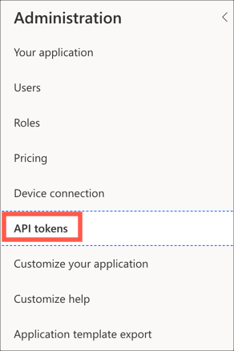
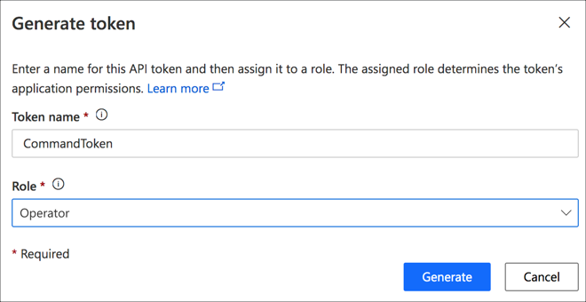
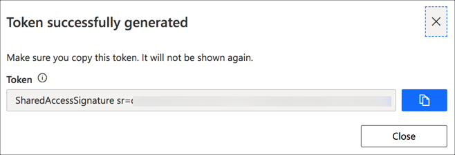
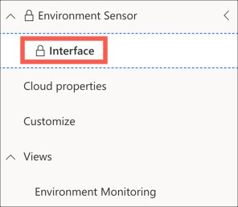
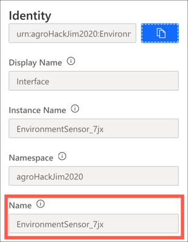

# Trigger an Azure IoT Central command if the soil moisture is too low

In this step you created an Azure Function triggered by Azure Stream Analytics to check soil moisture. In the [next step](./ExecuteIoTCommand.md) you will add to this function to trigger the Azure IoT Central command with a value depending on the level of the soil moisture, turning the LED off if the soil is wet, and on if it is dry.

## Execute Azure IoT Central commands

Commands created on an interface on a device template can be executed by making REST requests against the Azure IoT Central app. These requests can pass values to the command.

The REST request is made against your IoT Central app, for a specific device, interface and command, passing in data as a JSON object. The request is authorized using an API key.

### Get the API key

API keys are created in Azure IoT Central and can have different permissions, including the ability to administrate the entire application. These are strings that are passed in the headers of a REST request.

1. Open the app in Azure IoT Central

1. Select **Administration** from the left-hand menu

   

1. Select **API tokens** from the *Admistration* menu

   

1. Select **+ Generate token**

   

1. Fill in the token details

   1. Give the token a name, such as `CommandToken`

   1. Set the *Role* to `Operator`. This is the lowest level of access and allows commands to be called, but no changes to be made to the app

   1. Select **Generate**

   

1. The token will be generated and shown. Take a note of this token as once this dialog is dismissed it is impossible to retrieve the token again. If you need the value you will have to delete the token and create a new one.

   

### Build the REST request

The URL for the REST request to execute a command is in the following format:

```sh
https://{app_name}.azureiotcentral.com/api/preview/devices/{device_id}/components/{interface_name}/commands/{command_name}
```

* `{app_name}` is the URL of the Azure IoT Central app, the part before `.azureiotcentral.com` on the URL when loading the app in your browser

* `{device_id}` is the ID of the device, for this workshop the device id is `raspberry_pi`

* `{interface_name}` is the name of the interface

* `{command_name}` is the name of the command, for this workshop the command is named `needs_watering`

> In this workshop, the device id is hard coded to the Raspberry Pi. In a real world scenario you would have multiple devices, so the device id would need to be added to the telemetry so that the function can be run for and control multiple devices

#### Get the interface Id

1. Select **Device templates** from the left-hand menu in your Azure IoT Central app

1. Select the *Environment Sensor* device template

1. Select **Interface** from the *Environment Sensor* menu

   

1. Select the **View identity** button

   

1. Copy the value of the *Name* field

   

1. Create the REST URL by replacing the `{app_name}` and `{interface_name}` in the following string:

   ```sh
    https://{app_name}.azureiotcentral.com/api/preview/devices/raspberry_pi/components/{interface_name}/commands/needs_watering
    ```

### Test the REST API

To test the REST API you will need a tool like Postman. You can install Postman from the [Postman.com](https://www.postman.com/).

1. Set the request type to `POST`

1. Set the URL to the one you just generated

   

1. In the *Headers* section add a new header.

   1. Set the *Key* to `Authorization`

   1. Set the *Value* to the API token you created earlier

   

1. In the *Body* section add JSON to set the request value

   1. Set the body type to `raw`

   1. Set the raw type to `JSON`

   1. Set the body to the following

      ```json
      {
          "request": true
      }
      ```

      A request value of `true` should turn the LED on, a value of `false` will turn it off

    

1. Select **Send**

1. The command will be executed with the request value, and Postman will show a success status, usually 201. You will also see the LED turn on or off. Change the `request` value to see the LED toggle on and off.

## Execute the command from an Azure Function

Depending on the soil moisture levels sent by Azure Stream Analytics to the function, the LED should be turned on or off. Based off the Grove capacitive soil moisture sensor, an average soil moisture value of less than 500 would be considered dry and in need of watering.

### Add the moisture check to the Azure function

1. Open the Azure Function app in Visual Studio Code

1. Add the following code above the `main` function

   ```python
   def needs_watering(soil_moisture):
      return soil_moisture < 500
   ```

   This function just checks the soil moisture value against a threshold of 500. In a later part you will add logic to check weather, and only flag that the plant needs watering if the soil is dry and rain is not forecast.

1. Call the new `needs_watering` method in the `main` function and put the value into a dictionary ready to send to the REST API as JSON. Add the following code at the end of the `main` function before the `return` statement.

    ```python
    def main(req: func.HttpRequest) -> func.HttpResponse:
        ...
        # Check if the plant needs watering
        request = { 'request' : needs_watering(soil_moisture) }

        # Return a 200 status
        return func.HttpResponse(f"OK")
    ```

1. Save the file if necessary

### Call the REST API

#### Add the requests package

To make REST requests in Python, you can use the Pip package `requests`. This contains a low barrier to entry API for making REST calls.

1. Open the `requirements.txt` file from the root of the function app in Visual Studio Code

1. Add the following line to the end of the file

   ```sh
   requests
   ```

1. Save the file if necessary

   > There is no need to install this package as it will be done automatically for you when you run the function app in the debugger

#### Set an environment variable for the API token

Setting values such as API tokens is code is bad practice. It makes it hard to change these values and too easy to put them somewhere like source code control where they can be stolen. It is better to put them in configuration files and load them on demand.

When running locally, Azure Functions uses a local file for configuration called `local.settings.json` with the values being made available as environment variables. When running in Azure, these values can be set in the *Application Settings* and accessed the same way.

1. Open the `local.settings.json` file from the root of the function app in Visual Studio Code

1. Add and entry inside the `values` node for the API token called `IOT_CENTRAL_API_TOKEN`

    ```json
    {
      "IsEncrypted": false,
      "Values": {
        "AzureWebJobsStorage": "",
        "FUNCTIONS_WORKER_RUNTIME": "python",
        "IOT_CENTRAL_API_TOKEN": "<Api_token>"
      }
    }
    ```

    Set the value of `<Api_token>` to be the API token created in the Azure IoT Central app earlier

1. Open the `__init__.py` file from the `SoilMoistureCheck` folder in Visual Studio Code

1. Add the following code to the top of the file to import the `os` module

   ```python
   import os
   ```

1. Below the imports, declare a field for the API key reading the value from the `IOT_CENTRAL_API_TOKEN` environment variable

   ```python
   # Get the environment variables
   iot_central_api_token = os.environ['IOT_CENTRAL_API_TOKEN']
   ```

#### Call the REST API

1. Open the `__init__.py` file from the `SoilMoistureCheck` folder in Visual Studio Code

1. Add the following code to the top of the file to import the `requests` module

   ```python
   import requests
   ```

1. In the `main` method after the call to `needs_watering`, add the following code to define the URL, the headers and the JSON body of the REST call

    ```python
    def main(req: func.HttpRequest) -> func.HttpResponse:
        ...
        # Check if the plant needs watering
        request = { 'request' : needs_watering(soil_moisture) }

        # Call the REST API
        url = '<rest_url>'
        headers = {'Authorization': iot_central_api_token}

        # Return a 200 status
        return func.HttpResponse(f"OK")
    ```

    Set `<rest_url>` to be the URL of the command that you used in Postman in the last step

1. Add a call to the `requests` module to make the REST call passing in the headers and json

    ```python
    def main(req: func.HttpRequest) -> func.HttpResponse:
        ...
        # Check if the plant needs watering
        request = { 'request' : needs_watering(soil_moisture) }

        # Call the REST API
        url = '<rest_url>'
        headers = {'Authorization': iot_central_api_token}

        requests.post(url, headers=headers, json = request)

        # Return a 200 status
        return func.HttpResponse(f"OK")
    ```

1. Save the file if necessary

#### Test the function

1. Run the function using either Visual Studio Code, or from the Azure CLI by following the instructions from [an earlier step](https://github.com/jimbobbennett/AgroHack/blob/master/Steps/CreateFunction.md#test-the-function). Instead of calling the function from a browser, test it from Postman so you can pass the same JSON packet to the function that would be passed from Stream Analytics

1. In Postman, set the URL to be `http://localhost:7071/api/SoilMoistureCheck`, the URL of the local function running in the debugger

1. In the *Body* section add JSON to set the telemetry values

   1. Set the body type to `raw`

   1. Set the raw type to `JSON`

   1. Set the body to the following

      ```json
      {
        "temperature": 25,
        "pressure": 100,
        "humidity": 75,
        "soil_moisture": 1000
      }
      ```

      Values of `soil_moisture` of 500 or more will turn the LED off, less will turn it on.

1. Select **Send**

1. You will see the function being called in the debug output, and by changing the value of `soil_moisture` in the JSON you will be able to turn the LED on and off.

## Deploy the Azure Function

The function can be deployed using Visual Studio Code or the Azure CLI.

### Deploy the function using Visual Studio Code

As well as deploying the function, the API Key also needs to be deployed from the `local.settings.json` file into the Application Settings in Azure.

1. From Visual Studio Code, launch the command palette

   * On macOS, press command+shift+p
   * On Windows or Linux, press ctrl+shift+p

1. Search for `Azure Functions: Upload Local Settings` and select it

   

1. Select your subscription and the Azure Functions app you deployed to

1. The settings will be uploaded, and you will see the settings being uploaded in the *Output* window

   

1. Launch the command palette

1. Search for `Azure Functions: Deploy to Function App` and select it

   

1. Select your subscription and the Azure Functions app you deployed to

1. You will be prompted to confirm the deploy, overwriting the existing app. Select **Deploy**.

   

### Deploy the function using the Azure CLI

1. Deploy your function to this app with the following command

   ```sh
   func azure functionapp publish <function_app_name> --build remote --publish-local-settings --overwrite-settings
   ```

   For `<function_app_name>` use the name you used when creating the Function App.

   The `--publish-local-settings` option will push settings from the `local.settings.json` file into the Application Settings in Azure.

   When the settings are published, if the values will overwrite an existing setting, you will be asked to confirm if this is what you want to do. The `--overwrite-settings` setting tells the call to always overwrite, and not ask.

### Test the function app

Every 5 minutes the stream analytics job will average the soil moisture and send it to the function app. If the value is less than 500 the LED will light up, otherwise it will turn off.

1. Put the soil sensor in some dry soil, with a moisture value less than 500. You can check this value on the Azure IoT Central app device view. After 5 minutes the LED will turn on.

1. Put the soil sensor in wet soil, or water the plant. After 5 minutes the LED will turn off.

> To make testing faster, you can update the stream analytics job query to use a smaller time window

<hr>

In this step you added to the function to trigger the Azure IoT Central command with a value depending on the level of the soil moisture, turning the LED off if the soil is wet, and on if it is dry. In the [next step](./CheckWeatherWithAzureMaps.md) you will call Azure Maps to check the weather forecast before sending the needs watering command.
