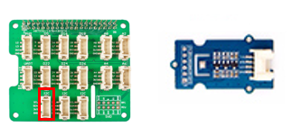
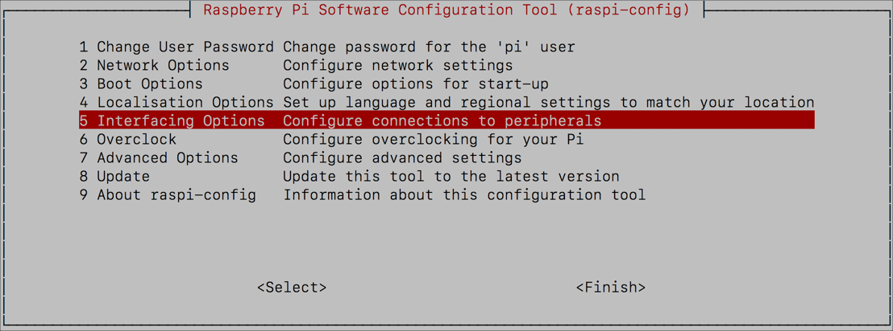
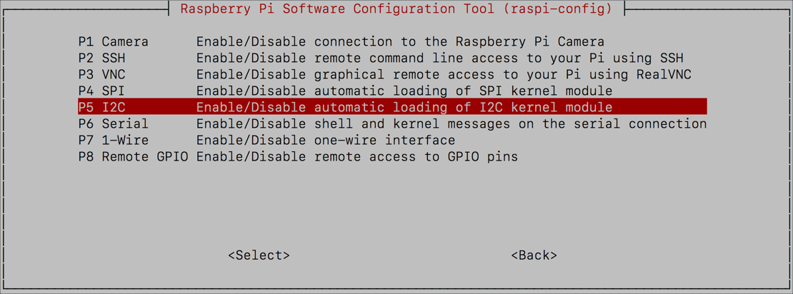
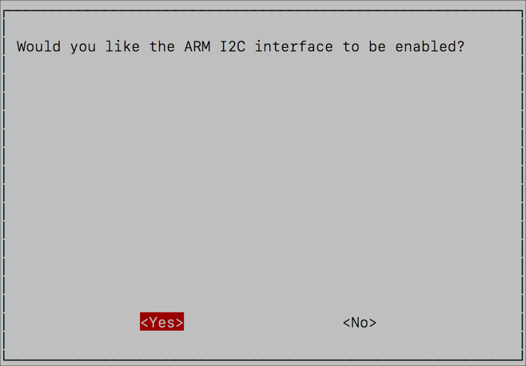
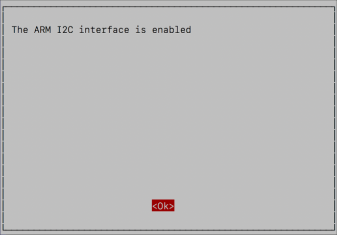
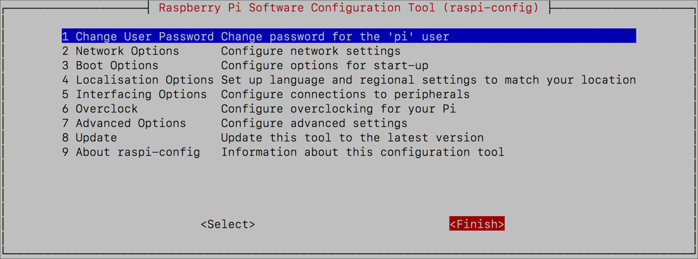

# Set up the environment monitor

In this step you will assemble the hardware, and set up the Pi.

## Assemble the hardware

1. Fix the Grove base hat to the pins on the Raspberry Pi, pressing down firmly.

   

1. Connect the Grove capacitive moisture sensor to socket **A2** on the Grove base hat

   

1. Connect the Grove BME280 Temperature/Pressure/Humidity sensor to the bottom left I2C socket

   

1. Connect the Grove LED socket kit to socket **D16** on the Grove base hat, and insert an LED with the longer leg inserted into the positive hole

## Install the Pi software

### Set up Raspbian Lite

You will need to install Raspbian Lite on a micro-SD card. You can find the official instructions on how to configure this card in the [Raspberry Pi Installation guide](https://www.raspberrypi.org/documentation/installation/installing-images/README.md). You will need the latest version of Raspbian Lite.

Once the SD card has Raspbian Lite installed on it, you will need to modify a couple of files to allow you connect the Pi to WiFi, and to access the device over SSH to program it.

### Enable SSH

1. Locate the SD card in File Explorer (Windows) or Finder (macOS). It will be in a volume called `boot`.

1. Create a file in the root of `boot` called `ssh`. This file can be empty, it just needs to exist to allow you to ssh into the device

1. Create another new file in the root of the SD card called `wpa_supplicant.conf`. This file contains the WiFi connection details. Add the following to this file:

    ```sh
    ctrl_interface=DIR=/var/run/wpa_supplicant GROUP=netdev
    update_config=1
    country=US

    network={
        ssid="YOURSSID"
        psk="YOURPASSWORD"
        scan_ssid=1
    }
    ```

    Replace `YOURSSID` and `YOURPASSWORD` with the SSID and password of your WiFi.

## Start up the Pi

1. Insert the SD Card into the Pi

1. Connect it to power, somewhere near your plant, and power it on

1. Insert the Grove capacitive moisture sensor into the plants soil

1. Fix the temperature/pressure/humidity sensor somewhere where it will give a consistent reading

1. Test the connection by SSHing into your Pi. From your computer connect to `pi@raspberrypi.local`.

    ```sh
    ssh pi@raspberrypi.local
    ```

    If the host cannot be found then if you know the IP address (for example by using your routers management software) then you can log in to `pi@192.168.0.1`, replacing `192.168.0.1` with the IP address of your Pi. You can also use the [Adafruit Pi Finder utility](https://learn.adafruit.com/the-adafruit-raspberry-pi-finder/finding-and-connecting) to locate it's IP address.

    The default password is `raspberry`.

1. Change the password from the default using the following command:

    ```sh
    passwd
    ```

    Enter the current password, then a new password, then confirm the new password.

## Turn off the I2C interface

For the grove sensor to work, the I2C interface needs to be disabled as all I2C communications take place over the Grove base hat. 

1. Launch the configuration tool on the Pi using the following command

    ```sh
    sudo raspi-config
    ```

1. Select option *5 Interfacing Options*

   

1. Select option *P5 I2C*

    

1. Select *No*

   

1. Select *OK*

    

1. Select *Finish*

   

1. Reboot the Pi with the following command

    ```sh
    sudo reboot
    ```

    The SSH connection will be terminated, so you will need to reconnect.

Once the Pi reboots the I2C interface will be disabled.

<hr>

In this step you assembled the hardware, and set up the Pi. In the [next step](./CreateTheAppInIoTCentral.md), you will create the app in Azure IoT Central.
